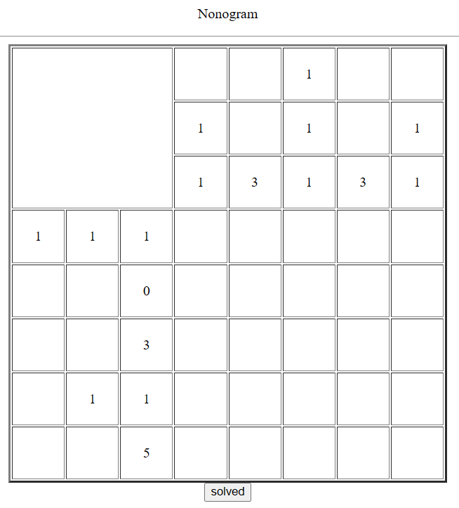
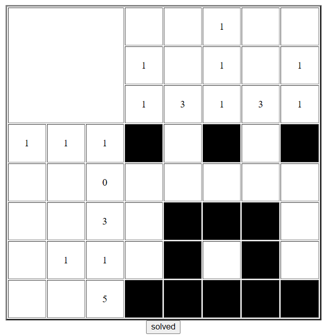
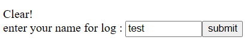
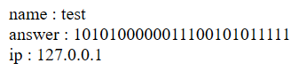

The initial site wants us to solve a nonogram.



This is the nonogram solution.  



After clicking `solved`, it gives us a site with input field, in which we can set the name of our log, this then redirects us to a site with all our logs.  




One thing worth noting is that there is also a "value", which is boolean value we did not explicitly set.



If we inspect source code of the site with input field, we can find this.

```html
<form method=post action=index.php>
    <input type=hidden name=answer value=1010100000011100101011111>Clear!<br>
    enter your name for log : 
    <input type=text name=id maxlength=10 size=10>
    <input type=submit value='submit'>
```

This form also sends a `value`, this is a possible SQLi vulnerability.

For SQL injection, we can change the `value` to:
```SQL
value="1' OR '1'='1"
```

This input `1' OR '1'='1` works as follows:

1. **`1'`**:
   - The `1` sets the value to `1`.
   - The `'` (single quote) closes the string literal in the original SQL query.

2. **`OR`**:
   - This is a logical operator that allows us to evaluate next conditions.
   - We can use it to get boolean `True` even if left side of statement is false

3. **`'1'='1'`**:
   - This is a condition that always evaluates to `true` because `'1'` is equal to `'1'`.
   - The final `'` (single quote) is not explicitly included in the input because the original query already includes a closing quote to terminate the string.


Thats it!