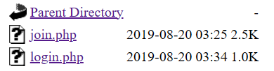

Initial site is made out of 2 humble buttons.


Clicking join gives us `Access_Denied` alert.


If we click on `Login`, we will be redirected to another site with login formular. Any inputed data will give us `Wrong password` error.


After inspecting the URL, we can see that we were redirected from initial 

```
https://webhacking.kr/challenge/web-05/
``` 
to

```
https://webhacking.kr/challenge/web-05/mem/login.php
```

The `mem/` is a another directory.
Changing URL to

```
https://webhacking.kr/challenge/web-05/mem/
```

will redirect us to apache server directory.

Now we can click on `join.php` and it will move us to

```
https://webhacking.kr/challenge/web-05/mem/login.php
```



This is an empty site with alert, but now we can inspect the source code.

```PHP
<html>
    <title>Challenge 5</title>
</head>
<body bgcolor=black>
    <center>
        <script>
            l = 'a';
            ll = 'b';
            lll = 'c';
            llll = 'd';
            lllll = 'e';
            llllll = 'f';
            lllllll = 'g';
            llllllll = 'h';
            lllllllll = 'i';
            llllllllll = 'j';
            lllllllllll = 'k';
            llllllllllll = 'l';
            lllllllllllll = 'm';
            llllllllllllll = 'n';
            lllllllllllllll = 'o';
            llllllllllllllll = 'p';
            lllllllllllllllll = 'q';
            llllllllllllllllll = 'r';
            lllllllllllllllllll = 's';
            llllllllllllllllllll = 't';
            lllllllllllllllllllll = 'u';
            llllllllllllllllllllll = 'v';
            lllllllllllllllllllllll = 'w';
            llllllllllllllllllllllll = 'x';
            lllllllllllllllllllllllll = 'y';
            llllllllllllllllllllllllll = 'z';
            I = '1';
            II = '2';
            III = '3';
            IIII = '4';
            IIIII = '5';
            IIIIII = '6';
            IIIIIII = '7';
            IIIIIIII = '8';
            IIIIIIIII = '9';
            IIIIIIIIII = '0';
            li = '.';
            ii = '<';
            iii = '>';
            lIllIllIllIllIllIllIllIllIllIl = lllllllllllllll + llllllllllll + llll + llllllllllllllllllllllllll + lllllllllllllll + lllllllllllll + ll + lllllllll + lllll;
            lIIIIIIIIIIIIIIIIIIl = llll + lllllllllllllll + lll + lllllllllllllllllllll + lllllllllllll + lllll + llllllllllllll + llllllllllllllllllll + li + lll + lllllllllllllll + lllllllllllllll + lllllllllll + lllllllll + lllll;
            if (eval(lIIIIIIIIIIIIIIIIIIl).indexOf(lIllIllIllIllIllIllIllIllIllIl) == -1) {
                alert('bye');
                throw "stop";
            }
            if (eval(llll + lllllllllllllll + lll + lllllllllllllllllllll + lllllllllllll + lllll + llllllllllllll + llllllllllllllllllll + li + 'U' + 'R' + 'L').indexOf(lllllllllllll + lllllllllllllll + llll + lllll + '=' + I) == -1) {
                alert('access_denied');
                throw "stop";
            } else {
                document.write('<font size=2 color=white>Join</font><p>');
                document.write('.<p>.<p>.<p>.<p>.<p>');
                document.write('<form method=post action=' + llllllllll + lllllllllllllll + lllllllll + llllllllllllll + li + llllllllllllllll + llllllll + llllllllllllllll + '>');
                document.write('<table border=1><tr><td><font color=gray>id</font></td><td><input type=text name=' + lllllllll + llll + ' maxlength=20></td></tr>');
                document.write('<tr><td><font color=gray>pass</font></td><td><input type=text name=' + llllllllllllllll + lllllllllllllllllllllll + '></td></tr>');
                document.write('<tr align=center><td colspan=2><input type=submit></td></tr></form></table>');
            }
        </script>
</body>
</html>
```

After deciphering this code (all you really need to do is use change all occurences tool) we get this:

```PHP
lIbIbIbIbIbIbIbIbIbIl = o + l + d + z + o + m + b + i + e;
lIIIIIIIIIIIIIIIIIIl = d + o + c + u + m + e + n + t + li + c + o + o + k + i + e;
if (eval(lIIIIIIIIIIIIIIIIIIl).indexOf(lIbIbIbIbIbIbIbIbIbIl) == -1) {
    alert('bye');
    throw "stop";
}
if (eval(d + o + c + u + m + e + n + t + li + 'U' + 'R' + 'L').indexOf(m + o + d + e + '=' + I) == -1) {
    alert('access_denied');
    throw "stop";
} else {
    document.write('<font size=2 color=white>Join</font><p>');
    document.write('.<p>.<p>.<p>.<p>.<p>');
    document.write('<form method=post action=' + j + o + i + n + li + p + h + p + '>');
    document.write('<table border=1><tr><td><font color=gray>id</font></td><td><input type=text name=' + i + d + ' maxlength=20></td></tr>');
    document.write('<tr><td><font color=gray>pass</font></td><td><input type=text name=' + p + w + '></td></tr>');
    document.write('<tr align=center><td colspan=2><input type=submit></td></tr></form></table>');
}
```

First `if` statement checks if there is a `document.cookie` named `oldzombie`, which we can easily add.


Second `if` statement looks for `mode=1` in `document.url`, which we can also easily add.
```
https://webhacking.kr/challenge/web-05/mem/join.php?mode=1
```

Now we are allowed to create a account ! 


But after trying to login with these credentials, we will get warning that we need to be logged in as a `admin`.
Creating a account with username `admin` is not allowed, because there already exists a account named `admin`. 

Simple bypass is to add a spacebar before the text, then we can login as a admin and thats it.