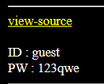

## Analysis

The initial website gives us information on our login credentials aswell as a link to the source code.



This is the source-code part that interests us. Basically, the credentials are encoded 20 times using base64 and then numbers are replaced by some characters.

Then they are set to cookies.

```PHP
if(!$_COOKIE['user']){
  $val_id="guest";
  $val_pw="123qwe";
  for($i=0;$i<20;$i++){
    $val_id=base64_encode($val_id);
    $val_pw=base64_encode($val_pw);
  }
  $val_id=str_replace("1","!",$val_id);
  $val_id=str_replace("2","@",$val_id);
  $val_id=str_replace("3","$",$val_id);
  $val_id=str_replace("4","^",$val_id);
  $val_id=str_replace("5","&",$val_id);
  $val_id=str_replace("6","*",$val_id);
  $val_id=str_replace("7","(",$val_id);
  $val_id=str_replace("8",")",$val_id);

  $val_pw=str_replace("1","!",$val_pw);
  $val_pw=str_replace("2","@",$val_pw);
  $val_pw=str_replace("3","$",$val_pw);
  $val_pw=str_replace("4","^",$val_pw);
  $val_pw=str_replace("5","&",$val_pw);
  $val_pw=str_replace("6","*",$val_pw);
  $val_pw=str_replace("7","(",$val_pw);
  $val_pw=str_replace("8",")",$val_pw);

  Setcookie("user",$val_id,time()+86400,"/challenge/web-06/");
  Setcookie("password",$val_pw,time()+86400,"/challenge/web-06/");
  echo("<meta http-equiv=refresh content=0>");
  exit;
}
?>
```

When the website is checking if the correct user has logged in, it decodes them using same way - gets credentials from cookies, replaces characters with numbers and then decodes them via base64 20 times.

```PHP
<?php
$decode_id=$_COOKIE['user'];
$decode_pw=$_COOKIE['password'];

$decode_id=str_replace("!","1",$decode_id);
$decode_id=str_replace("@","2",$decode_id);
$decode_id=str_replace("$","3",$decode_id);
$decode_id=str_replace("^","4",$decode_id);
$decode_id=str_replace("&","5",$decode_id);
$decode_id=str_replace("*","6",$decode_id);
$decode_id=str_replace("(","7",$decode_id);
$decode_id=str_replace(")","8",$decode_id);

$decode_pw=str_replace("!","1",$decode_pw);
$decode_pw=str_replace("@","2",$decode_pw);
$decode_pw=str_replace("$","3",$decode_pw);
$decode_pw=str_replace("^","4",$decode_pw);
$decode_pw=str_replace("&","5",$decode_pw);
$decode_pw=str_replace("*","6",$decode_pw);
$decode_pw=str_replace("(","7",$decode_pw);
$decode_pw=str_replace(")","8",$decode_pw);

for($i=0;$i<20;$i++){
  $decode_id=base64_decode($decode_id);
  $decode_pw=base64_decode($decode_pw);
}
```

At the end, it checks if decoded credentials are for admin and if they are, it gives us the flag.

```PHP
if($decode_id=="admin" && $decode_pw=="nimda"){
  solve(6);
}
```

## Exploit
We can create a python code that does the same thing for us, then we can encode `admin` credentials and set them as cookie values.

```Python
import base64

username = "admin"
password = "nimda"

def encode(text):
    encoded_bytes = text.encode('utf-8')

    for i in range(20):
        encoded_bytes = base64.b64encode(encoded_bytes)


    encoded_bytes = encoded_bytes.decode()

    encoded_bytes = encoded_bytes.replace("1","!")
    encoded_bytes = encoded_bytes.replace("2","@")
    encoded_bytes = encoded_bytes.replace("3","$")
    encoded_bytes = encoded_bytes.replace("4","^")
    encoded_bytes = encoded_bytes.replace("5","&")
    encoded_bytes = encoded_bytes.replace("6","*")
    encoded_bytes = encoded_bytes.replace("7","(")
    encoded_bytes = encoded_bytes.replace("8",")")

    return encoded_bytes

if __name__ == "__main__":
    f = open("encoded.txt","w")
    f.write("USERNAME\n")
    f.write(encode(username) + "\n\n\n")
    f.write("PASSWORD\n")
    f.write(encode(password))
```