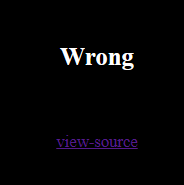

### Analysis

Base webpage greets us with a text says "Wrong".


Apart from that text, it also links us to the source code.

```PHP
<?php
  include "../../config.php";
  if($_GET['view_source']) view_source();
?><html>
<head>
<title>Challenge 11</title>
<style type="text/css">
body { background:black; color:white; font-size:10pt; }
</style>
</head>
<body>
<center>
<br><br>
<?php
  $pat="/[1-3][a-f]{5}_.*$_SERVER[REMOTE_ADDR].*\tp\ta\ts\ts/";
  if(preg_match($pat,$_GET['val'])){
    solve(11);
  }
  else echo("<h2>Wrong</h2>");
  echo("<br><br>");
?>
<a href=./?view_source=1>view-source</a>
</center>
</body>
</html>
```

This is the part that interests us the most:
```PHP
 $pat="/[1-3][a-f]{5}_.*$_SERVER[REMOTE_ADDR].*\tp\ta\ts\ts/";
  if(preg_match($pat,$_GET['val'])){
    solve(11);
  }
```

The code matches the value `val` from a `GET` request using a regex pattern with the following rules:

1. `[1-3]`: The first character must be a number between 1 and 3.
2. `[a-f]{5}`: The next five characters must be any lowercase letters from `a` to `f`.
3. `_.*$_SERVER[REMOTE_ADDR]`: After that, there must be an underscore (`_`) followed by the IP address of the client (retrieved from `$_SERVER['REMOTE_ADDR']`).
4. `.*\tp\ta\ts\ts/"`: The pattern ends with any characters, followed by the sequence `\tp\ta\ts\ts/"`.

To bypass the code, we need to create a payload that will follow these rules, and put it into `val`.

### Solution

So our final solution is:
```
https://webhacking.kr/challenge/code-2/?val=1aaaaa_[myIP].*%09p%09a%09s%09s
```