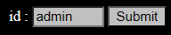
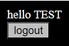

### Analysis

The initial website is empty except for an input field with a pre-defined value of `admin`.  


After submitting, an alert informs us that we are not an admin.  
However, entering any value other than `admin` logs us in successfully.  


Upon logging in, inspecting the cookies reveals a saved `userid`.  


For example:  
- Logging in as `1` results in the following `userid` value:  
  ```
  YzRjYTQyMzhhMGI5MjM4MjBkY2M1MDlhNmY3NTg0OWI%3D
  ```
- Logging in as `11` results in this `userid`:  
  ```
  YzRjYTQyMzhhMGI5MjM4MjBkY2M1MDlhNmY3NTg0OWJjNGNhNDIzOGEwYjkyMzgyMGRjYzUwOWE2Zjc1ODQ5Ygo=
  ```

These values look similar, so decoding them with a Base64 decoder reveals the following:  
- Decoding `YzRjYTQyMzhhMGI5MjM4MjBkY2M1MDlhNmY3NTg0OWI%3D` (for `1`) gives us:  
  ```
  c4ca4238a0b923820dcc509a6f75849b7
  ```
- Decoding `YzRjYTQyMzhhMGI5MjM4MjBkY2M1MDlhNmY3NTg0OWJjNGNhNDIzOGEwYjkyMzgyMGRjYzUwOWE2Zjc1ODQ5Ygo=` (for `11`) gives us:  
  ```
  c4ca4238a0b923820dcc509a6f75849b7c4ca4238a0b923820dcc509a6f75849b7
  ```

It becomes clear that the values are concatenated hashes of the input. By leveraging this, we can construct arbitrary concatenations that will still work.

---

### Exploit

To solve this challenge, we need the `userid` to match the hash value of `admin`. To achieve this, we construct the following segments:  

- `a`:  
  ```
  MGNjMTc1YjljMGYxYjZhODMxYzM5OWUyNjk3NzI2NjE%3D  
  0cc175b9c0f1b6a831c399e2697726617
  ```
- `d`:  
  ```
  ODI3N2UwOTEwZDc1MDE5NWI0NDg3OTc2MTZlMDkxYWQ  
  8277e0910d750195b448797616e091ad
  ```
- `m`:  
  ```
  NmY4ZjU3NzE1MDkwZGEyNjMyNDUzOTg4ZDlhMTUwMWI  
  6f8f57715090da2632453988d9a1501b
  ```
- `i`:  
  ```
  ODY1YzBjMGI0YWIwZTA2M2U1Y2FhMzM4N2MxYTg3NDE%3D  
  865c0c0b4ab0e063e5caa3387c1a87417
  ```
- `n`:  
  ```
  N2I4Yjk2NWFkNGJjYTBlNDFhYjUxZGU3YjMxMzYzYTE  
  7b8b965ad4bca0e41ab51de7b31363a1
  ```

Concatenating these hash values gives:  
```
0cc175b9c0f1b6a831c399e2697726618277e0910d750195b448797616e091ad6f8f57715090da2632453988d9a1501b865c0c0b4ab0e063e5caa3387c1a87417b8b965ad4bca0e41ab51de7b31363a1
```

Finally, we Base64-encode this concatenated value:  
```
MGNjMTc1YjljMGYxYjZhODMxYzM5OWUyNjk3NzI2NjE4Mjc3ZTA5MTBkNzUwMTk1YjQ0ODc5NzYxNmUwOTFhZDZmOGY1NzcxNTA5MGRhMjYzMjQ1Mzk4OGQ5YTE1MDFiODY1YzBjMGI0YWIwZTA2M2U1Y2FhMzM4N2MxYTg3NDE3YjhiOTY1YWQ0YmNhMGU0MWFiNTFkZTdiMzEzNjNhMQ==
```